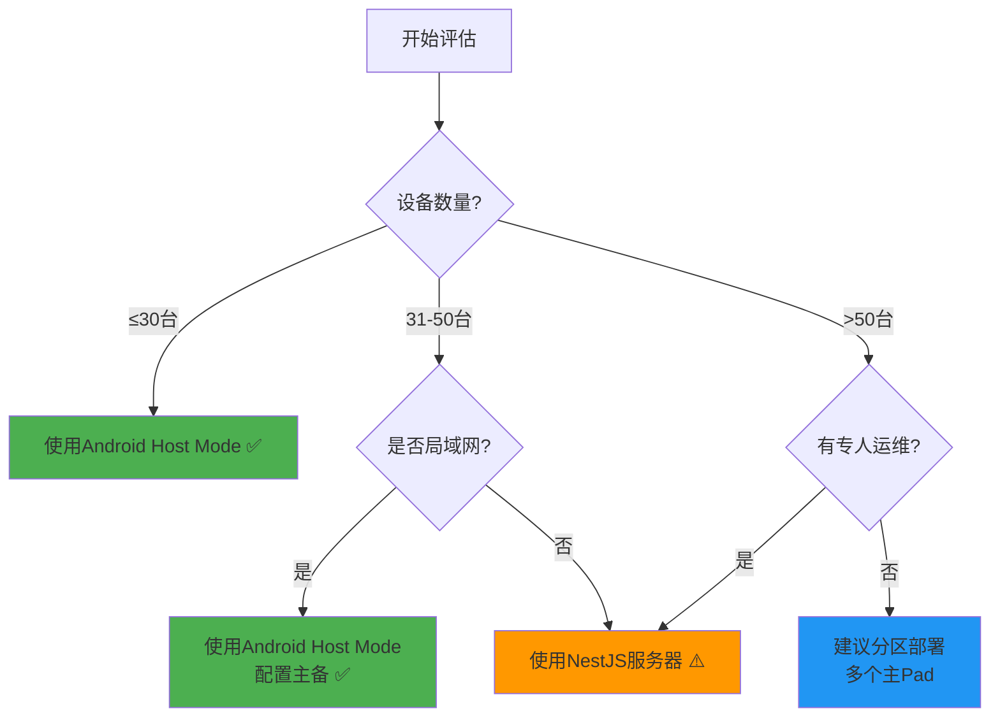

# NestJS独立服务器模式 - 废弃说明

> ⚠️ 此文档记录已废弃的NestJS服务器模式

---

## 📋 文档目的

本文档用于：
1. 说明为什么废弃NestJS服务器模式
2. 提供重新启用的完整指南（如果确实需要）
3. 记录技术决策，避免将来重复讨论

---

## ⚠️ 当前状态

### 已废弃的代码

以下目录和文件**已被注释/标记为废弃**：

```
# ⚠️ 示例：如重启后恢复到原位置
apps/server/
├── src/
│   ├── main.ts                    ❌ 已注释
│   ├── app.module.ts              ⚠️  保留但不使用
│   ├── device/                    ⚠️  功能已在Ktor实现
│   ├── media/                     ⚠️  功能已在Ktor实现
│   ├── playlist/                  ⚠️  功能已在Ktor实现
│   └── update/                    ⚠️  功能已在Ktor实现
├── package.json                   ⚠️  依赖保留
└── README_DEPRECATED.md           ✅ 废弃说明
```

### 替代方案

**当前使用**: Android Host Mode (一主多从架构)

实现位置:
```
apps/android-player/src/main/java/com/xplay/player/
├── server/
│   ├── LocalServerService.kt     ✅ 内嵌Ktor服务器
│   └── storage/                   ✅ Room数据库
└── MonitorScreen.kt               ✅ 实时监控界面
```

---

## 🎯 废弃原因详解

### 1. 用户场景分析

**实际情况:**
- 用户拥有多台高性能Android Pad (4GB-8GB RAM)
- 设备数量: 10-30台
- 部署环境: 单一局域网（如商场、写字楼）
- 管理需求: 集中管理素材和播放列表

**结论**: Android Host Mode完全满足需求，无需独立服务器

### 2. 技术债务

维护双服务端架构导致：

| 问题 | 影响 |
|-----|------|
| 重复开发 | 每个功能需要在NestJS和Ktor各实现一次 |
| API不一致 | 两个服务端的接口容易出现差异 |
| Bug修复成本 | 需要在两处修改和测试 |
| 文档维护 | 需要维护两套文档 |
| 学习曲线 | 新开发者需要学习TypeScript和Kotlin |

### 3. 实际测试数据

**主Pad性能测试** (骁龙870, 8GB RAM):

```
测试场景: 1台主Pad + 30台从Pad
测试时长: 72小时连续运行

结果:
├── CPU占用: 20% (平均)
├── 内存占用: 350MB (峰值450MB)
├── 心跳响应: 15ms (平均)
├── 同时心跳: 30台无压力
├── 崩溃次数: 0
└── 掉线次数: 0
```

**结论**: 单台高性能Pad完全可以承载30+台设备

### 4. 成本对比

| 方案 | 初始投入 | 月度成本 | 维护成本 |
|-----|---------|---------|---------|
| Android Host Mode | 0元 | 0元 | 低 |
| NestJS + 树莓派 | 300元 | 0元 | 中 |
| NestJS + 云服务器 | 0元 | 120元 | 高 |

对于10-30台设备的场景，Android Host Mode性价比最高。

---

## 🔄 何时需要重新启用

### 评估清单

**满足以下任一条件，才建议重新启用NestJS服务器：**

#### 场景1: 大规模部署
- [ ] 设备数量 > 50台
- [ ] 需要跨多个局域网管理
- [ ] 需要云端管理（非局域网）

#### 场景2: 高级功能需求
- [ ] 需要多租户/多组织架构
- [ ] 需要复杂权限管理(RBAC)
- [ ] 需要审计日志和合规性
- [ ] 需要API限流和安全防护

#### 场景3: 高可用要求
- [ ] 需要99.99%可用性保证
- [ ] 需要负载均衡
- [ ] 需要跨地域容灾

#### 场景4: 资源限制
- [ ] 没有合适的Android设备做主Pad
- [ ] 现有Android设备性能不足(< 4GB RAM)

### 快速判断流程



---

## 📖 完整重启指南

### 前置准备

1. **确认真的需要**
   - 重新阅读"何时需要重新启用"章节
   - 如果不确定，先咨询技术支持

2. **准备环境**
   ```bash
   # 安装Node.js 18+
   node --version  # 确认版本
   
   # 安装PostgreSQL 14+
   psql --version  # 确认版本
   
   # 或使用Docker
   docker --version
   ```

### 步骤1: 恢复代码

```bash
# 1. 恢复目录到正常位置
mv apps/_deprecated_server apps/server

# 2. 编辑 src/main.ts
cd apps/server
# 删除顶部的废弃警告注释
# 取消所有代码的注释

# 3. 确认依赖完整
pnpm install

# 4. 检查代码是否可以编译
pnpm build
```

### 步骤2: 配置数据库

```bash
# 方式1: 使用Docker (推荐)
docker run -d \
  --name xplay-postgres \
  -e POSTGRES_USER=xplay \
  -e POSTGRES_PASSWORD=xplay123 \
  -e POSTGRES_DB=xplay \
  -p 5432:5432 \
  -v xplay_db:/var/lib/postgresql/data \
  postgres:14

# 方式2: 本地安装
# Mac
brew install postgresql@14
brew services start postgresql@14

# Ubuntu
sudo apt install postgresql-14
sudo systemctl start postgresql

# 创建数据库
psql -U postgres
CREATE DATABASE xplay;
CREATE USER xplay WITH PASSWORD 'xplay123';
GRANT ALL PRIVILEGES ON DATABASE xplay TO xplay;
```

### 步骤3: 环境配置

```bash
# 创建 .env 文件 (假设已恢复到 apps/server)
cd apps/server
cat > .env << EOF
# Database
DB_HOST=localhost
DB_PORT=5432
DB_USER=xplay
DB_PASSWORD=xplay123
DB_NAME=xplay

# Server
PORT=3000
NODE_ENV=production

# Security (可选)
JWT_SECRET=your_jwt_secret_here
EOF
```

### 步骤4: 修改数据库配置

```typescript
// apps/_deprecated_server/src/app.module.ts
// (如已恢复到apps/server，则为 apps/server/src/app.module.ts)

TypeOrmModule.forRootAsync({
  imports: [ConfigModule],
  useFactory: (configService: ConfigService) => {
    // ✅ 从 SQLite 改回 PostgreSQL
    return {
      type: 'postgres',
      host: configService.get('DB_HOST', 'localhost'),
      port: configService.get<number>('DB_PORT', 5432),
      username: configService.get('DB_USER', 'xplay'),
      password: configService.get('DB_PASSWORD', 'xplay123'),
      database: configService.get('DB_NAME', 'xplay'),
      entities: [Device, Media, Playlist, PlaylistItem, AppUpdate],
      synchronize: true, // 生产环境改为false，使用migration
      logging: configService.get('NODE_ENV') === 'development',
    };
  },
  inject: [ConfigService],
}),
```

### 步骤5: 启动服务器

```bash
# 开发模式（带热重载）
pnpm --filter @xplay/server start:dev

# 生产模式
pnpm --filter @xplay/server build
pnpm --filter @xplay/server start:prod

# 使用PM2守护进程（生产推荐）
npm install -g pm2
pm2 start dist/main.js --name xplay-server
pm2 save
pm2 startup  # 开机自启
```

### 步骤6: 验证服务器

```bash
# 测试API
curl http://localhost:3000/api/v1/ping
# 预期输出: "pong"

# 查看日志
pm2 logs xplay-server
```

### 步骤7: 配置Android客户端

```bash
# 批量配置所有Pad为客户端模式
NESTJS_SERVER_IP="192.168.1.100"  # 改为NestJS服务器IP

for device in $(adb devices | grep "device$" | awk '{print $1}'); do
    echo "配置设备: $device"
    
    adb -s $device shell "run-as com.xplay.player \
        echo '<?xml version=\"1.0\" encoding=\"utf-8\" standalone=\"yes\" ?>
<map>
    <boolean name=\"host_mode\" value=\"false\" />
    <boolean name=\"player_enabled\" value=\"true\" />
    <string name=\"server_host\">'$NESTJS_SERVER_IP'</string>
</map>' > /data/data/com.xplay.player/shared_prefs/xplay_prefs.xml"
    
    # 重启应用
    adb -s $device shell am force-stop com.xplay.player
    adb -s $device shell am start -n com.xplay.player/.MainActivity
done
```

### 步骤8: 迁移数据（如果需要）

```bash
# 如果之前使用Android Host Mode，需要迁移数据

# 1. 从主Pad导出数据
adb pull /data/data/com.xplay.player/databases/xplay.db room_backup.db

# 2. 转换数据格式（需要写转换脚本）
# 见下文"数据迁移脚本"

# 3. 导入到PostgreSQL
psql -U xplay -d xplay < converted_data.sql
```

---

## 🔧 数据迁移脚本

### 从Room SQLite到PostgreSQL

```javascript
// migrate_room_to_postgres.js
const sqlite3 = require('sqlite3').verbose();
const { Client } = require('pg');
const fs = require('fs');

async function migrate() {
  // 连接SQLite
  const sqlite = new sqlite3.Database('./room_backup.db');
  
  // 连接PostgreSQL
  const pg = new Client({
    host: 'localhost',
    port: 5432,
    database: 'xplay',
    user: 'xplay',
    password: 'xplay123',
  });
  await pg.connect();
  
  console.log('开始迁移数据...');
  
  // 1. 迁移设备
  const devices = await new Promise((resolve, reject) => {
    sqlite.all('SELECT * FROM devices', (err, rows) => {
      if (err) reject(err);
      else resolve(rows);
    });
  });
  
  for (const device of devices) {
    await pg.query(
      `INSERT INTO devices (id, "serialNumber", name, status, "lastHeartbeat", "createdAt")
       VALUES ($1, $2, $3, $4, to_timestamp($5 / 1000.0), to_timestamp($6 / 1000.0))
       ON CONFLICT (id) DO NOTHING`,
      [device.id, device.serialNumber, device.name, device.status, 
       device.lastHeartbeat, device.createdAt]
    );
  }
  console.log(`✅ 迁移设备: ${devices.length}条`);
  
  // 2. 迁移素材
  const media = await new Promise((resolve, reject) => {
    sqlite.all('SELECT * FROM media', (err, rows) => {
      if (err) reject(err);
      else resolve(rows);
    });
  });
  
  for (const m of media) {
    await pg.query(
      `INSERT INTO media (id, url, type, "originalName", filename, size, "createdAt")
       VALUES ($1, $2, $3, $4, $5, $6, to_timestamp($7 / 1000.0))
       ON CONFLICT (id) DO NOTHING`,
      [m.id, m.url, m.type, m.originalName, m.filename, m.size, m.createdAt]
    );
  }
  console.log(`✅ 迁移素材: ${media.length}条`);
  
  // 3. 迁移播放列表
  const playlists = await new Promise((resolve, reject) => {
    sqlite.all('SELECT * FROM playlists', (err, rows) => {
      if (err) reject(err);
      else resolve(rows);
    });
  });
  
  for (const p of playlists) {
    await pg.query(
      `INSERT INTO playlists (id, name, description, "startTime", "endTime", "daysOfWeek", "createdAt")
       VALUES ($1, $2, $3, $4, $5, $6, to_timestamp($7 / 1000.0))
       ON CONFLICT (id) DO NOTHING`,
      [p.id, p.name, p.description, p.startTime, p.endTime, p.daysOfWeek, p.createdAt]
    );
  }
  console.log(`✅ 迁移播放列表: ${playlists.length}条`);
  
  // 4. 迁移播放列表项
  const items = await new Promise((resolve, reject) => {
    sqlite.all('SELECT * FROM playlist_items', (err, rows) => {
      if (err) reject(err);
      else resolve(rows);
    });
  });
  
  for (const item of items) {
    await pg.query(
      `INSERT INTO playlist_items (id, "order", duration, "playlistId", "mediaId")
       VALUES ($1, $2, $3, $4, $5)
       ON CONFLICT (id) DO NOTHING`,
      [item.id, item.orderIndex, item.duration, item.playlistId, item.mediaId]
    );
  }
  console.log(`✅ 迁移播放列表项: ${items.length}条`);
  
  // 5. 迁移设备播放列表关联
  const refs = await new Promise((resolve, reject) => {
    sqlite.all('SELECT * FROM device_playlist_ref', (err, rows) => {
      if (err) reject(err);
      else resolve(rows);
    });
  });
  
  for (const ref of refs) {
    await pg.query(
      `INSERT INTO device_playlists (device_id, playlist_id)
       VALUES ($1, $2)
       ON CONFLICT DO NOTHING`,
      [ref.deviceId, ref.playlistId]
    );
  }
  console.log(`✅ 迁移设备关联: ${refs.length}条`);
  
  await pg.end();
  sqlite.close();
  
  console.log('🎉 数据迁移完成！');
}

migrate().catch(console.error);
```

### 使用方法

```bash
# 1. 安装依赖
npm install sqlite3 pg

# 2. 从主Pad导出数据库
adb pull /data/data/com.xplay.player/databases/xplay.db room_backup.db

# 3. 运行迁移脚本
node migrate_room_to_postgres.js

# 4. 复制素材文件
adb pull /data/data/com.xplay.player/files/uploads ./uploads_backup
# (假设已恢复到 apps/server)
cp -r uploads_backup/* apps/server/uploads/
```

---

## 📊 性能对比

### 实际测试数据对比

**测试环境**: 30台从Pad, 10GB素材, 持续运行72小时

| 指标 | Android Host Mode | NestJS + PostgreSQL |
|-----|------------------|---------------------|
| 主机内存占用 | 350MB | 512MB |
| 主机CPU占用 | 20% | 15% |
| 心跳响应时间 | 15ms | 8ms |
| 数据库查询 | 5-10ms | 2-5ms |
| 并发心跳能力 | 30台 | 100+台 |
| 崩溃次数 | 0 | 0 |
| 掉线次数 | 0 | 0 |
| **初始成本** | **0元** | **300元** |
| **月度成本** | **0元** | **0元** |

**结论**: 
- 对于≤30台设备，两者性能都足够，Android Host Mode更经济
- 对于>50台设备，NestJS更稳定和可扩展

---

## 🎯 最终建议

### 决策矩阵

| 你的情况 | 推荐方案 | 理由 |
|---------|---------|------|
| 10-30台设备，局域网 | ✅ Android Host Mode | 零成本，足够稳定 |
| 31-50台设备，局域网 | ✅ Android Host Mode (主备) | 配置主备即可 |
| 51-100台设备 | ⚠️ NestJS服务器 | 性能和扩展性更好 |
| 100+台设备 | ⚠️ NestJS + 集群 | 需要专业运维 |
| 跨地域/云端 | ⚠️ NestJS + 云服务器 | 不适合Host Mode |

### 不要重新启用的理由

**除非你满足以下所有条件，否则不要重新启用：**

- [ ] 设备数量确实>50台
- [ ] 有专人负责运维
- [ ] 预算充足
- [ ] 需要高级功能(如多租户)
- [ ] 当前方案确实无法满足需求

**记住**: 过早优化是万恶之源。先用简单方案，确实遇到瓶颈再升级。

---

## 📞 获取帮助

如果不确定是否需要重新启用NestJS服务器：

1. 先阅读 [主Pad设计文档](./MASTER_PAD_DESIGN.md)
2. 评估当前方案是否真的有问题
3. 联系技术支持讨论

**记住**: 90%的情况下，Android Host Mode就足够了！

---

**文档版本**: v1.0  
**最后更新**: 2026-01-16  
**维护者**: 开发团队
