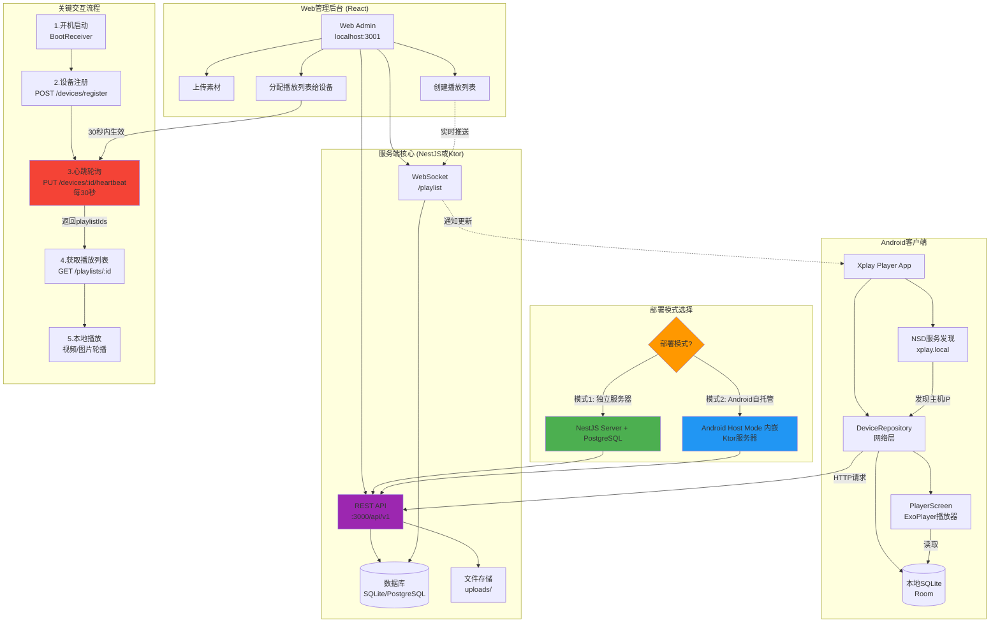
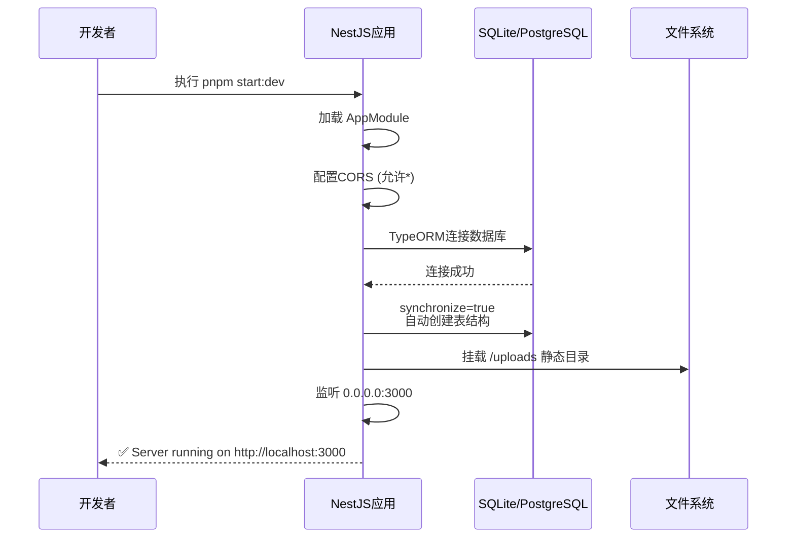
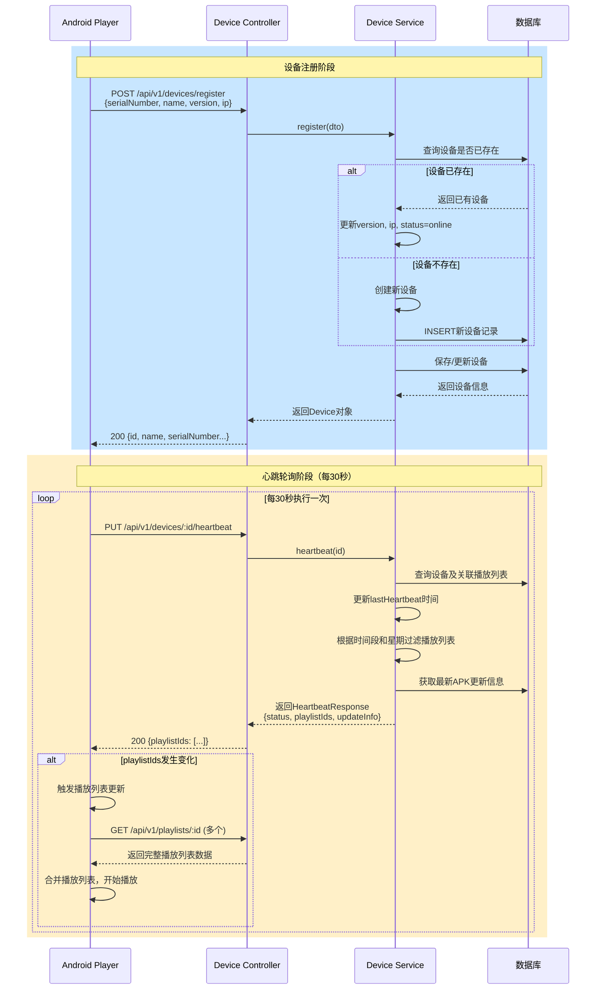
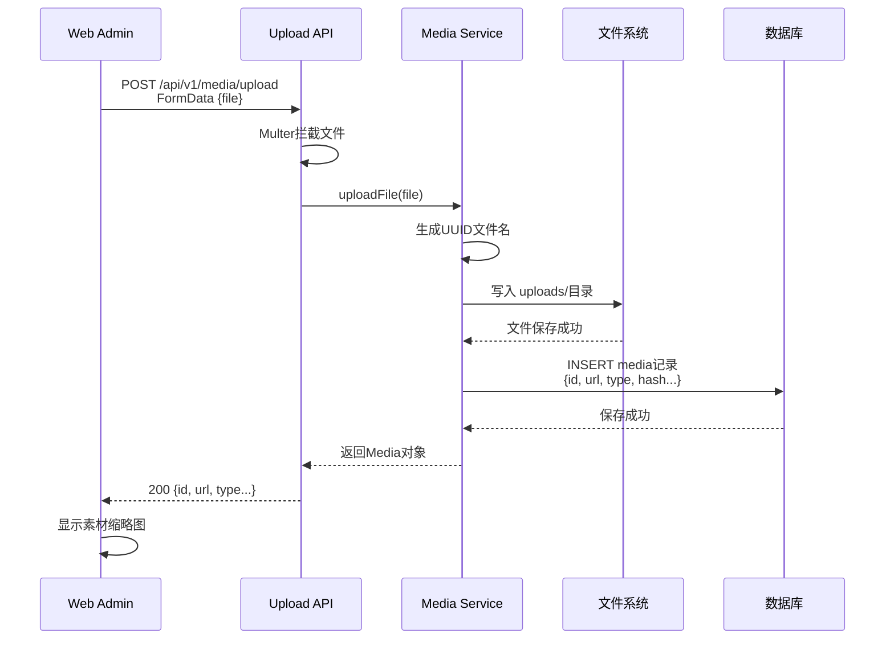
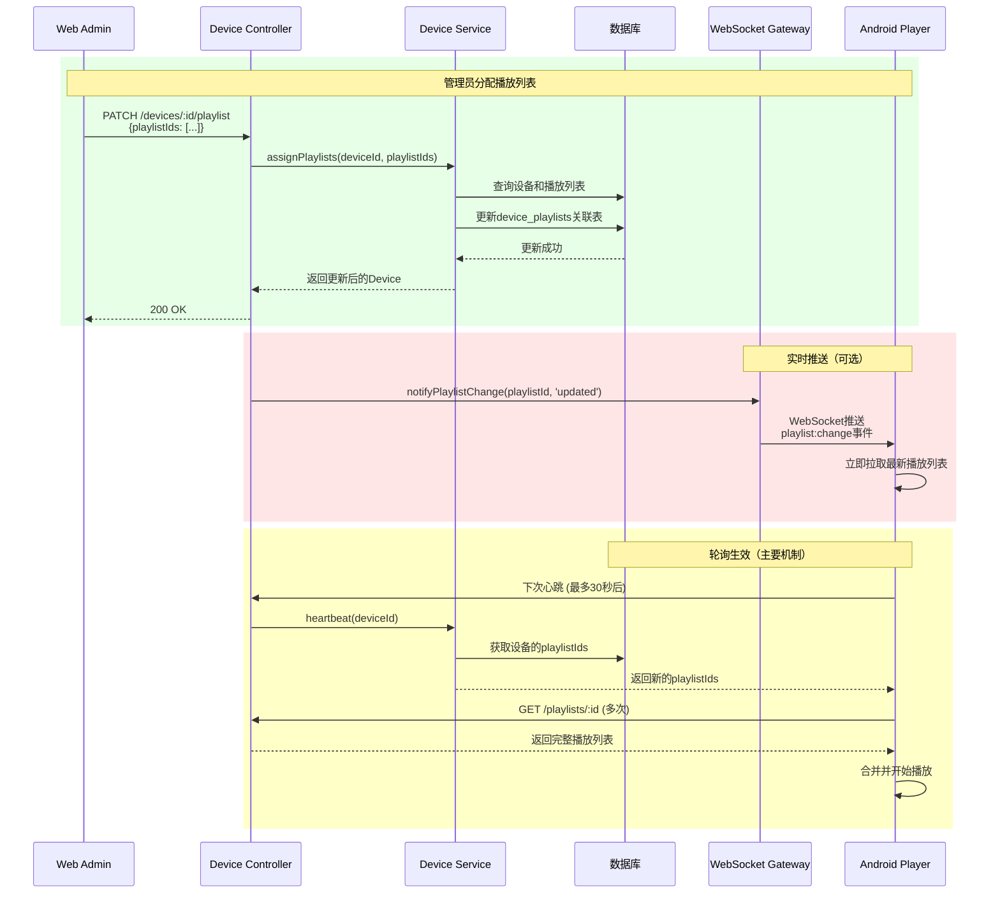
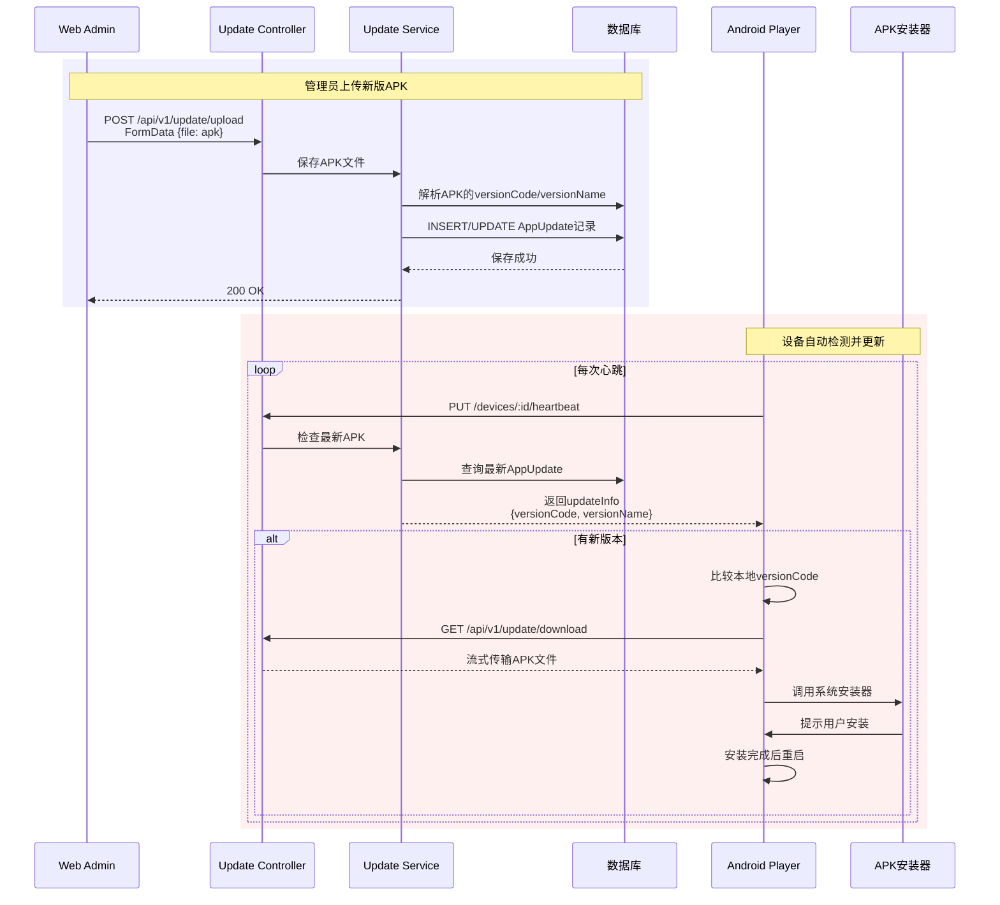
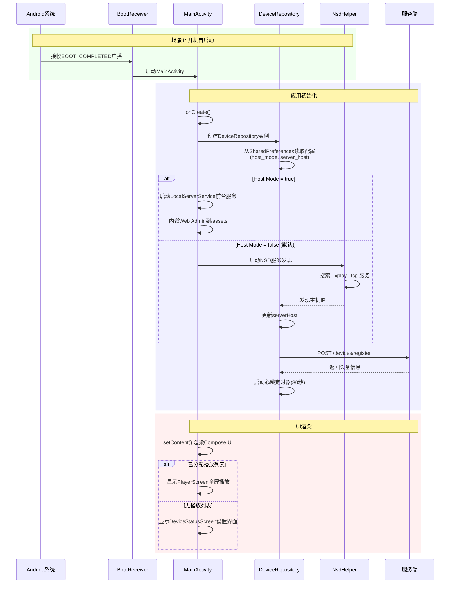
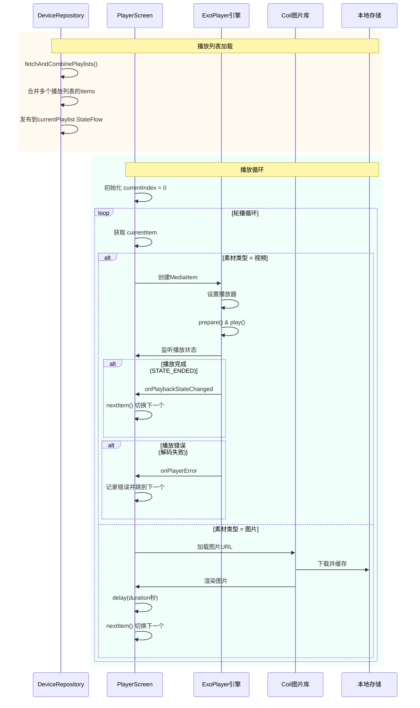
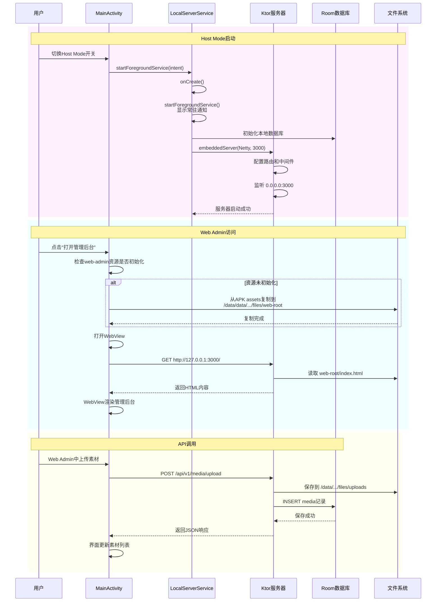
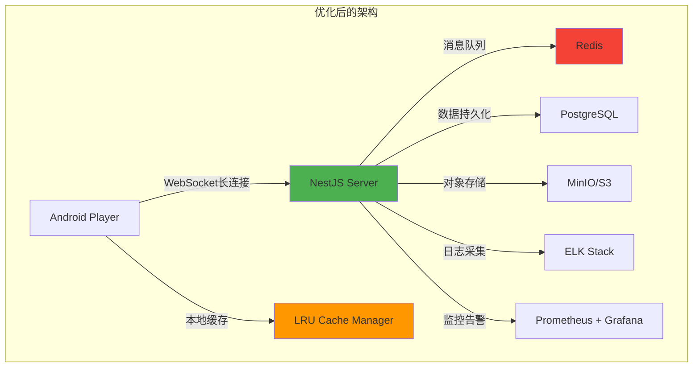

# Xplay 系统流程详细分析与问题定位指南

> **创建时间**: 2026-01-16  
> **目标**: 帮助快速定位问题，理清服务端和客户端的完整交互流程

---

## ⚠️ 重要说明

**本文档同时涵盖两种架构的分析：**

1. **Android Host Mode** (当前推荐) ✅
   - 服务端代码: `apps/android-player/src/main/java/com/xplay/player/server/LocalServerService.kt`
   - 内嵌Ktor服务器 + Room数据库

2. **NestJS服务器** (已废弃) ⚠️
   - 原路径: `apps/server/` → 现已移至 `apps/_deprecated_server/`
   - 详见 [废弃说明](./DEPRECATED_NESTJS_SERVER.md)

**文档中涉及NestJS的代码引用仅供参考，新开发请使用Android Host Mode。**

---

## 📊 一、整体架构流程图



---

## 🔄 二、服务端完整流程

### 2.1 启动流程



**关键技术点：**
- **数据库**: 开发用SQLite (`xplay.db`)，生产推荐PostgreSQL
- **CORS**: 允许所有来源 (`origin: '*'`)，方便Android和Web访问
- **静态文件**: `uploads/`目录通过`ServeStaticModule`暴露为`/uploads`路由
- **自动建表**: `synchronize: true` 开发环境自动同步表结构

**⚠️ 易出问题点：**
1. **端口被占用**: 3000端口冲突 → 修改`main.ts`中的端口
2. **数据库锁**: SQLite多并发写入可能死锁 → 生产环境切换PostgreSQL
3. **文件权限**: `uploads/`目录权限不足 → 确保应用有读写权限
4. **路径问题**: 上传文件路径在不同环境下可能不一致

---

### 2.2 设备注册与心跳流程



**关键代码位置：**
- **Android Host Mode**: `apps/android-player/.../server/LocalServerService.kt` (推荐) ✅
- **NestJS** (已废弃): `apps/_deprecated_server/src/device/device.service.ts` ⚠️
  - `register()` 方法: 第55-80行
  - `heartbeat()` 方法: 第82-129行
- 客户端: `apps/android-player/src/main/java/com/xplay/player/DeviceRepository.kt`
  - `registerDevice()` 方法: 第97-125行
  - `startHeartbeat()` 方法: 第127-158行

**⚠️ 易出问题点：**
1. **设备重复注册**: `serialNumber`未获取到导致每次都创建新设备
   - **定位**: 检查`DeviceUtils.getSerialNumber()`是否返回空
   - **日志**: 服务端会打印"Registering device: xxx"
   
2. **心跳超时**: 30秒未发送心跳，设备显示offline
   - **定位**: Android端网络异常或服务器宕机
   - **检查**: 客户端日志搜索"Heartbeat error"
   
3. **播放列表不生效**: 
   - **原因**: 时间段/星期过滤导致播放列表被排除
   - **定位**: 检查`heartbeat()`方法中的时间过滤逻辑(第98-111行)
   - **验证**: 播放列表的`startTime`/`endTime`/`daysOfWeek`是否正确

4. **网络不通**: 
   - **症状**: 客户端显示"与服务器不在同一局域网"
   - **检查清单**:
     - [ ] 服务器是否在`0.0.0.0`监听（不是`localhost`）
     - [ ] 防火墙是否开放3000端口
     - [ ] Android设备和服务器是否在同一网段
     - [ ] 使用`curl http://服务器IP:3000/api/v1/ping`测试连通性

---

### 2.3 素材上传与管理流程



**关键代码位置：**
- **Android Host Mode** (推荐) ✅:
  - `apps/android-player/.../server/LocalServerService.kt` - 素材上传API
  - 存储路径: `/data/data/com.xplay.player/files/uploads/`
- **NestJS** (已废弃) ⚠️:
  - `apps/_deprecated_server/src/media/media.service.ts`
  - 存储路径: `apps/_deprecated_server/uploads/`

**⚠️ 易出问题点：**
1. **文件过大导致超时**:
   - **现象**: 大视频上传卡住
   - **解决**: 配置Multer的文件大小限制和超时时间
   
2. **文件类型判断错误**:
   - **位置**: `media.service.ts` 通过mimetype判断类型
   - **问题**: 某些视频格式可能被识别为`application/octet-stream`
   
3. **存储空间不足**:
   - **检查**: `df -h` 查看磁盘空间
   - **优化**: 实现LRU缓存清理机制（当前未实现）

4. **URL访问404**:
   - **原因**: 静态文件挂载路径配置错误
   - **检查**: `AppModule`中的`ServeStaticModule`配置

---

### 2.4 播放列表分发流程



**关键技术点：**
1. **多对多关系**: Device和Playlist通过`device_playlists`中间表关联
2. **播放列表合并**: Android端会合并多个播放列表的items为一个大列表轮播
3. **时间段过滤**: 服务端心跳时会根据当前时间和星期过滤播放列表

**⚠️ 易出问题点：**
1. **分配后不立即生效**:
   - **原因**: 依赖心跳轮询，最长延迟30秒
   - **优化方向**: 集成WebSocket即时推送（已实现但未启用）

2. **播放列表循环播放顺序混乱**:
   - **定位**: `DeviceRepository.kt` 第160-192行的合并逻辑
   - **问题**: 多个播放列表的items按数据库顺序合并，可能不符合预期

3. **播放列表删除后设备崩溃**:
   - **原因**: 客户端缓存了已删除的播放列表ID
   - **解决**: 服务端返回空playlistIds后客户端应清空播放

---

### 2.5 APK远程更新流程



**关键代码位置：**
- **Android Host Mode** (推荐) ✅:
  - 服务端: `apps/android-player/.../server/LocalServerService.kt`
  - 客户端: `apps/android-player/.../DeviceRepository.kt` (第196-248行)
- **NestJS** (已废弃) ⚠️:
  - 服务端: `apps/_deprecated_server/src/update/update.service.ts`

**⚠️ 易出问题点：**
1. **下载失败**:
   - **原因**: APK文件过大，网络超时
   - **优化**: 实现断点续传（当前未实现）

2. **安装被拦截**:
   - **原因**: Android 8.0+需要REQUEST_INSTALL_PACKAGES权限
   - **检查**: `AndroidManifest.xml`是否声明权限

3. **循环下载**:
   - **现象**: APK已下载但不安装，每次心跳重复下载
   - **定位**: `ApkInstaller.install()`方法可能未正确调用系统安装器

---

## 🎬 三、Android客户端完整流程

### 3.1 应用启动流程



**关键代码位置：**
- 启动入口: `MainActivity.kt` 第69-84行
- 仓库初始化: `DeviceRepository.kt` 第45-56行
- 设备发现: `discovery/NsdHelper.kt`

**⚠️ 易出问题点：**
1. **开机自启失败**:
   - **原因**: 部分手机厂商限制开机自启
   - **解决**: 引导用户手动添加到自启动白名单

2. **Host Mode卡死**:
   - **症状**: 切换到Host Mode后界面无响应
   - **定位**: `LocalServerService.kt` 第106-307行的Ktor服务启动失败
   - **检查**: Logcat搜索"Failed to start server"

3. **NSD发现失败**:
   - **原因**: 路由器不支持mDNS或被防火墙阻止
   - **解决**: 手动输入服务器IP代替自动发现

---

### 3.2 播放引擎流程



**关键代码位置：**
- 播放器: `PlayerScreen.kt` 第33-81行
- 视频播放: `PlayerScreen.kt` 第85-145行
- 图片播放: 第74-78行使用Coil库

**⚠️ 易出问题点：**
1. **视频黑屏或绿屏**:
   - **原因**: 硬件解码器不支持该编码格式
   - **解决**: ExoPlayer已配置软解回退(`setEnableDecoderFallback(true)`)
   - **定位**: Logcat搜索"ExoPlayer Error"查看详细错误

2. **图片加载失败**:
   - **原因**: URL不可访问或格式不支持
   - **检查**: URL是否正确拼接(第60-68行的URL替换逻辑)
   - **问题**: `localhost`需要替换为实际服务器IP

3. **播放卡顿**:
   - **原因**: 
     - 网络带宽不足，视频缓冲慢
     - 图片分辨率过高，解码耗时
   - **优化**: 实现本地缓存机制（当前直接在线播放）

4. **轮播顺序错误**:
   - **定位**: `nextItem()` 逻辑(第38-42行)
   - **问题**: 取模运算导致索引越界

5. **播放列表为空**:
   - **症状**: 显示"Empty Playlist"黑屏
   - **原因**: 
     - 服务端未分配播放列表
     - 播放列表中没有素材
     - 心跳返回空的playlistIds

---

### 3.3 Host Mode内嵌服务器流程



**关键代码位置：**
- 服务入口: `server/LocalServerService.kt` 第53-318行
- 数据存储: `server/storage/XplayDatabase.kt`
- 静态资源: `utils/WebAdminInitializer.kt`

**⚠️ 易出问题点：**
1. **Host Mode无法访问**:
   - **症状**: 点击"打开管理后台"后白屏
   - **定位**: Logcat搜索"LocalServerService"查看启动日志
   - **检查清单**:
     - [ ] web-admin资源是否正确打包到APK的assets目录
     - [ ] `/data/data/com.xplay.player/files/web-root`目录是否有文件
     - [ ] Ktor服务器是否成功监听3000端口

2. **WebView文件上传失败**:
   - **原因**: Android WebView的文件选择器需要特殊处理
   - **已实现**: `MainActivity.kt` 第34-140行的文件选择器回调
   - **问题**: Activity重建时回调丢失(第126-139行)

3. **数据库冲突**:
   - **症状**: Host Mode和Client Mode切换后数据错乱
   - **原因**: Room数据库和服务端SQLite使用不同schema
   - **建议**: 切换模式时清空本地数据库

4. **内存不足**:
   - **原因**: Ktor服务器+ExoPlayer+WebView同时运行
   - **优化**: 在播放时关闭WebView，减少内存占用

---

## 🔧 四、关键系统交互点

### 4.1 网络层架构

```
┌─────────────────┐
│  Android Client │
└────────┬────────┘
         │ Retrofit
         ├──────────────────┐
         │                  │
         ▼                  ▼
┌─────────────────┐  ┌──────────────┐
│  NestJS Server  │  │  Ktor Server │
│   (独立部署)     │  │  (Host Mode) │
└────────┬────────┘  └──────┬───────┘
         │                  │
         ├──────────────────┤
         ▼                  ▼
┌─────────────────┐  ┌──────────────┐
│   PostgreSQL    │  │  Room SQLite │
│  (生产环境)      │  │  (本地存储)  │
└─────────────────┘  └──────────────┘
```

**API端点对比：**

| 端点 | NestJS | Ktor | 说明 |
|-----|--------|------|-----|
| 设备注册 | `POST /api/v1/devices/register` | `POST /api/v1/devices/register` | 完全一致 |
| 心跳 | `PUT /api/v1/devices/:id/heartbeat` | `PUT /api/v1/devices/:id/heartbeat` | 完全一致 |
| 素材上传 | `POST /api/v1/media/upload` | `POST /api/v1/media/upload` | 完全一致 |
| 播放列表 | `GET /api/v1/playlists/:id` | `GET /api/v1/playlists/:id` | 完全一致 |
| WebSocket | `ws://host/playlist` | ❌ 未实现 | Ktor未实现WebSocket |

**⚠️ 易出问题点：**
1. **URL拼接错误**:
   - **位置**: `DeviceRepository.kt` 第260-271行
   - **问题**: Host Mode使用`127.0.0.1`，Client Mode动态拼接
   - **陷阱**: `xplay.local`域名需要NSD解析为真实IP

2. **超时配置不一致**:
   - **Retrofit**: 默认10秒读超时
   - **Ktor**: 无超时配置
   - **建议**: 统一配置30秒超时

---

### 4.2 数据库Schema对比

**NestJS + TypeORM:**
```sql
-- devices表
CREATE TABLE devices (
  id UUID PRIMARY KEY,
  serialNumber VARCHAR UNIQUE,
  name VARCHAR,
  status VARCHAR,
  lastHeartbeat DATETIME,
  playlists ManyToMany -> playlists
);

-- media表
CREATE TABLE media (
  id UUID PRIMARY KEY,
  url VARCHAR,
  type VARCHAR, -- 'image' | 'video'
  hash VARCHAR,
  duration INT
);

-- playlists表
CREATE TABLE playlists (
  id UUID PRIMARY KEY,
  name VARCHAR,
  startTime VARCHAR, -- HH:mm:ss
  endTime VARCHAR,
  daysOfWeek VARCHAR, -- '1,2,3,4,5,6,7'
  items OneToMany -> playlist_items
);

-- 多对多关联表
CREATE TABLE device_playlists (
  device_id UUID,
  playlist_id UUID
);
```

**Ktor + Room:**
```sql
-- DeviceEntity
CREATE TABLE devices (
  id TEXT PRIMARY KEY,
  serialNumber TEXT UNIQUE,
  name TEXT,
  status TEXT,
  lastHeartbeat INTEGER, -- timestamp毫秒
  playlists: ManyToMany -> playlists (通过DevicePlaylistCrossRef)
);

-- MediaEntity (相同)
-- PlaylistEntity (相同，但无时间段字段)

-- DevicePlaylistCrossRef (关联表)
CREATE TABLE device_playlist_ref (
  deviceId TEXT,
  playlistId TEXT
);
```

**⚠️ 差异导致的问题：**
1. **时间字段类型不同**:
   - NestJS: `DATETIME`对象
   - Ktor: `INTEGER`时间戳
   - **影响**: 数据迁移时需要转换

2. **UUID vs String**:
   - NestJS: TypeORM生成的UUID对象
   - Ktor: 手动生成的UUID字符串
   - **建议**: 统一使用字符串格式

---

### 4.3 文件存储路径

**服务端 (NestJS):**
```
# ⚠️ NestJS目录结构（已废弃，现位于 apps/_deprecated_server/）
apps/_deprecated_server/
├── uploads/              # 上传文件存储
│   ├── {uuid}.mp4
│   ├── {uuid}.jpg
├── xplay.db              # SQLite数据库
└── src/
```

**Host Mode (Android):**
```
/data/data/com.xplay.player/
├── files/
│   ├── uploads/          # 上传文件
│   │   ├── {uuid}.mp4
│   ├── web-root/         # Web Admin静态资源
│   │   ├── index.html
│   │   └── assets/
│   └── update.apk        # APK更新文件
├── databases/
│   └── xplay.db          # Room数据库
└── cache/
    └── update.apk        # 下载的临时APK
```

**⚠️ 易出问题点：**
1. **路径硬编码**:
   - **问题**: 代码中写死`/uploads/`前缀
   - **影响**: 切换存储位置需要修改多处

2. **权限问题**:
   - **Android 10+**: 需要使用Scoped Storage
   - **当前实现**: 使用应用私有目录避开权限问题

3. **空间清理**:
   - **缺失**: 没有自动清理旧文件机制
   - **风险**: 长期运行后存储空间耗尽

---

## ⚠️ 五、高频问题定位表

### 5.1 设备上线问题

| 症状 | 可能原因 | 定位方法 | 解决方案 |
|-----|---------|---------|---------|
| 设备列表看不到设备 | 注册失败 | 检查Android日志"Registering device" | 确认服务器可访问 |
| 设备一直offline | 心跳失败 | 服务端日志搜索"Heartbeat sent" | 检查网络连接，重启应用 |
| 设备重复出现多个 | serialNumber获取失败 | 查看数据库devices表 | 修复`DeviceUtils.getSerialNumber()` |

### 5.2 播放问题

| 症状 | 可能原因 | 定位方法 | 解决方案 |
|-----|---------|---------|---------|
| 黑屏无内容 | 播放列表为空 | 检查`currentPlaylist`状态 | 在管理后台分配播放列表 |
| 视频不播放 | 解码器不支持 | Logcat搜索"ExoPlayer Error" | 转码视频为H.264格式 |
| 图片加载失败 | URL错误 | 检查Coil加载日志 | 验证URL可访问性 |
| 只播放一次就停止 | 循环逻辑错误 | 断点`nextItem()`方法 | 检查items列表是否为空 |

### 5.3 管理后台问题

| 症状 | 可能原因 | 定位方法 | 解决方案 |
|-----|---------|---------|---------|
| 上传文件失败 | 文件过大 | 浏览器Network面板查看请求 | 配置Multer限制 |
| 分配播放列表无效 | 心跳未同步 | 等待30秒后刷新设备列表 | 实现WebSocket即时推送 |
| WebView白屏 | 资源未初始化 | 检查`web-root`目录 | 重新复制assets资源 |
| 无法选择文件 | WebView回调丢失 | Logcat搜索"File picker" | Activity不要设置`android:launchMode="singleTop"` |

### 5.4 网络问题

| 症状 | 可能原因 | 定位方法 | 解决方案 |
|-----|---------|---------|---------|
| 连接超时 | 防火墙拦截 | `telnet 服务器IP 3000` | 开放3000端口 |
| 跨域错误 | CORS配置错误 | 浏览器Console查看错误 | 服务端已配置`origin: '*'` |
| NSD发现失败 | mDNS被禁用 | 检查路由器设置 | 手动输入IP |
| Host Mode无法访问 | 未监听0.0.0.0 | `netstat -an | grep 3000` | 检查Ktor监听地址 |

---

## 🛠 六、调试工具与技巧

### 6.1 日志关键字速查

**服务端 (NestJS):**
```bash
# 设备注册
grep "Registering device" server.log

# 心跳日志
grep "Heartbeat sent" server.log

# 播放列表更新
grep "Broadcasting playlist" server.log
```

**Android客户端:**
```bash
# 过滤应用日志
adb logcat | grep "DeviceRepository\|PlayerScreen\|LocalServerService"

# 网络请求
adb logcat | grep "OkHttp"

# ExoPlayer错误
adb logcat | grep "ExoPlayer"

# NSD服务发现
adb logcat | grep "NsdHelper"
```

### 6.2 数据库查询脚本

**NestJS SQLite:**
```bash
# 连接数据库
# Android Host Mode: adb pull 后查看
# NestJS (已废弃): sqlite3 apps/_deprecated_server/xplay.db

# 查看设备列表
SELECT id, name, status, datetime(lastHeartbeat/1000, 'unixepoch', 'localtime') FROM devices;

# 查看设备的播放列表
SELECT d.name, p.name FROM devices d
JOIN device_playlists dp ON d.id = dp.device_id
JOIN playlists p ON dp.playlist_id = p.id;

# 查看播放列表详情
SELECT p.name, m.url, pi.order, pi.duration 
FROM playlists p
JOIN playlist_items pi ON p.id = pi.playlistId
JOIN media m ON pi.mediaId = m.id
ORDER BY pi.order;
```

**Android Room (需要root或debuggable):**
```bash
# 导出数据库
adb pull /data/data/com.xplay.player/databases/xplay.db

# 使用上述SQL查询
```

### 6.3 网络抓包

**Charles/Fiddler配置:**
1. 设置Android代理指向PC
2. 安装SSL证书
3. 过滤域名: `*:3000`

**关键接口监控:**
- `POST /devices/register` - 查看serialNumber是否正确
- `PUT /devices/:id/heartbeat` - 查看返回的playlistIds
- `GET /playlists/:id` - 查看播放列表内容
- `POST /media/upload` - 查看上传文件大小

---

## 📝 七、架构优化建议

### 7.1 当前架构的痛点

1. **心跳轮询效率低**:
   - 30秒延迟导致播放列表分配不及时
   - **建议**: 实现WebSocket双向通信，服务端主动推送

2. **没有离线缓存**:
   - 断网后立即无法播放
   - **建议**: 实现素材本地缓存和预加载机制

3. **日志系统缺失**:
   - 问题定位全靠猜
   - **建议**: 集成Sentry或Bugly错误上报

4. **性能监控缺失**:
   - 不知道设备播放是否流畅
   - **建议**: 上报播放卡顿、加载耗时等指标

5. **数据库双架构维护成本高**:
   - NestJS TypeORM 和 Ktor Room 需要同步修改
   - **建议**: 统一使用REST API,废弃Host Mode或改为纯代理模式

### 7.2 推荐架构改进方案



**核心改进点：**
1. ✅ WebSocket替代轮询 → 实时响应
2. ✅ Redis做消息队列 → 高并发支持
3. ✅ LRU本地缓存 → 离线播放
4. ✅ 对象存储分离 → 扩展性强
5. ✅ 完善监控体系 → 问题秒级定位

---

## 📚 八、相关文档索引

- [系统架构文档](./ARCHITECTURE.md)
- [需求文档](../doc/requid.md)
- [快速开始](../README.md)
- [API文档](./API.md) (待补充)
- [部署手册](./DEPLOYMENT.md) (待补充)

---

**文档维护者**: AI Assistant  
**最后更新**: 2026-01-16  
**版本**: v1.0
