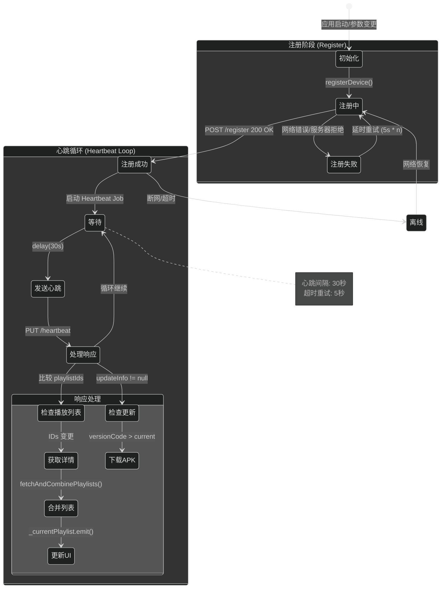
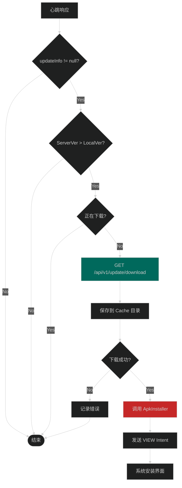
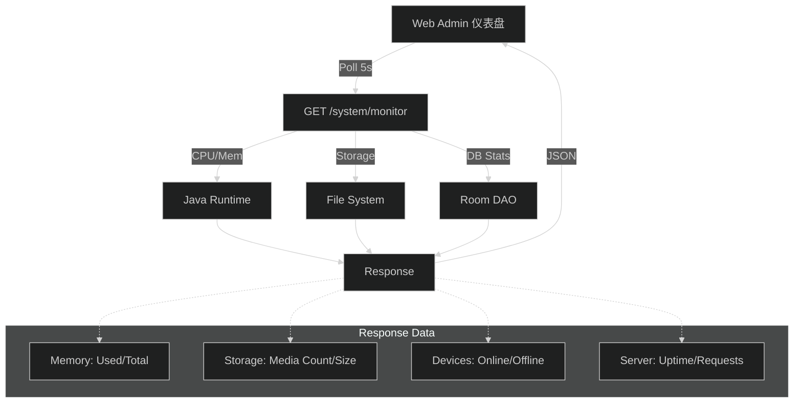

# Xplay 系统核心流程图集

> 本文档基于最新代码库（v1.1）自动生成，反映当前系统的实际运行逻辑。
> 所有图表均适配暗色主题。

---

## 1. 整体系统架构图 (System Architecture)

当前系统采用 **Android 客户端 + NestJS 服务端** 的经典 C/S 架构，但在 Host Mode 下，Android 客户端变身为独立服务器。

**主要变化**：
- 移除了 WebSocket 服务，目前全链路采用 **HTTP 轮询 (Heartbeat Polling)** 机制来同步状态。
- 新增了 **System Monitor** 模块，用于 Host Mode 下的性能监控。

```mermaid
%%{init: {'theme': 'dark'}}%%
graph LR
    subgraph "用户操作层"
        A1[管理员<br/>Web Admin] 
        A2[设备管理员<br/>Android 设置]
    end

    subgraph "应用层"
        B1[React 前端<br/>:3001]
        B2[Android App<br/>Player]
    end

    subgraph "服务层"
        C1[NestJS API<br/>:3000]
        C3[Ktor Server<br/>(Host Mode :3000)]
    end

    subgraph "数据层"
        D1[(PostgreSQL)]
        D2[uploads/<br/>文件存储]
        D3[(Room DB<br/>本地 SQLite)]
    end

    A1 --> B1
    A2 --> B2
    
    %% 标准模式连接
    B1 -->|HTTP REST| C1
    B2 -->|HTTP/Retrofit<br/>(轮询)| C1
    C1 --> D1
    C1 --> D2
    
    %% Host Mode 连接
    B2 -->|内部直连| C3
    C3 --> D3
    C3 --> D2
    
    %% 外部访问 Host Mode
    B1 -.->|局域网访问| C3

    style C1 fill:#2e7d32
    style C3 fill:#1565c0
    style D1 fill:#ef6c00
```

---

## 2. 设备注册与心跳流程 (Registration & Heartbeat)

这是设备与服务器保持同步的核心机制。代码路径：`DeviceRepository.kt`。



---

## 3. 内容下发时序图 (Content Delivery)

展示了从管理员上传素材到设备开始播放的完整链路。**注意：更新通过心跳被动触发。**

```mermaid
%%{init: {'theme': 'dark'}}%%
sequenceDiagram
    autonumber
    participant Admin as 管理员
    participant Web as Web Admin
    participant API as Server (NestJS/Ktor)
    participant DB as 数据库 (PG/Room)
    participant Android as Android设备

    rect rgb(30, 30, 40)
        Note over Admin,DB: 阶段一：素材与列表管理
        Admin->>Web: 上传素材 (Upload)
        Web->>API: POST /media/upload
        API->>DB: 存储文件 & 记录 DB
        
        Admin->>Web: 创建播放列表 (Create Playlist)
        Web->>API: POST /playlists
        API->>DB: 保存列表详情
        
        Admin->>Web: 分配给设备 (Assign)
        Web->>API: PATCH /devices/:id/playlist
        API->>DB: 更新 device_playlists 关联
    end

    rect rgb(40, 40, 30)
        Note over Android,API: 阶段二：设备轮询 (Polling)
        Android->>Android: 等待 30s 心跳周期
        Android->>API: PUT /devices/:id/heartbeat
        API->>DB: 查询最新 playlistIds & UpdateInfo
        DB-->>API: 返回数据
        API-->>Android: { status: "ok", playlistIds: ["p1", "p2"] }
    end

    rect rgb(30, 40, 30)
        Note over Android: 阶段三：同步与播放
        Android->>Android: 检测到 playlistIds 变更
        
        loop 遍历每个 ID
            Android->>API: GET /playlists/:id
            API-->>Android: 返回列表详情 (Items + Duration)
        end
        
        Android->>Android: 合并所有 Items
        Android->>Android: 启动播放器 (ExoPlayer/Coil)
    end
```



---

## 4. Host Mode 内部架构详解

Host Mode 是本项目的核心亮点，代码集中在 `LocalServerService.kt`。

```mermaid
%%{init: {'theme': 'dark'}}%%
graph TB
    subgraph "Android Process"
        direction TB
        
        subgraph "Service Layer"
            S1[LocalServerService]
            Ktor[Ktor Engine<br/>Netty :3000]
            S1 --> Ktor
        end
        
        subgraph "Route Handlers"
            Ktor --> R1[API Routes]
            Ktor --> R2[Static Assets]
            
            R1 --> A1["/devices/register"]
            R1 --> A2["/devices/heartbeat"]
            R1 --> A3["/playlists/:id"]
            R1 --> A4["/system/monitor"]
            
            R2 --> W1["Web Admin<br/>(React Build)"]
            R2 --> W2["Uploads<br/>(Media Files)"]
        end
        
        subgraph "Data Layer (LocalStore)"
            DS[LocalStore Object]
            R1 --> DS
            
            DS --> Room[Room Database<br/>(SQLite)]
            DS --> FS[File System<br/>/data/files/...]
        end
        
        subgraph "Security"
            Auth[Auth Interceptor]
            Ktor -.-> Auth
            Auth -->|Check Cookie| Token["xplay_auth"]
        end
    end

    style S1 fill:#e65100
    style Ktor fill:#2e7d32
    style DS fill:#1565c0
```

---

## 5. 自动更新流程 (OTA Update)

代码路径：`DeviceRepository.checkAndDownloadUpdate` 和 `ApkInstaller`。



---

## 6. 播放器状态机 (Player State Machine)

代码路径：`PlayerScreen.kt`。

```mermaid
%%{init: {'theme': 'dark'}}%%
stateDiagram-v2
    [*] --> Idle: 启动/无内容
    
    state "播放循环 (Playback Loop)" as Play {
        Idle --> Prepare: 收到新列表
        
        state "内容决策" as Decide {
            Prepare --> Video: Item is Video
            Prepare --> Image: Item is Image
        }
        
        state "视频播放" as Video {
            VideoInit: 初始化 ExoPlayer
            VideoPlay: 播放中
            VideoEnd: 播放结束 (STATE_ENDED)
            VideoErr: 播放错误 (onError)
            
            VideoInit --> VideoPlay
            VideoPlay --> VideoEnd
            VideoPlay --> VideoErr
        }
        
        state "图片展示" as Image {
            ImgLoad: Coil 加载
            ImgShow: 显示 (Delay duration)
            
            ImgLoad --> ImgShow
        }
        
        VideoEnd --> Next: 切换下一个
        VideoErr --> Next: 自动跳过
        ImgShow --> Next: 计时结束
        
        Next --> Prepare: 循环索引 +1
    }
    
    Play --> Idle: 列表被清空
    Play --> Prepare: 列表更新 (强制重置)
```

---

## 7. 性能监控数据流 (System Monitor)

Host Mode 下新增的 `/api/v1/system/monitor` 数据流向。



---

**文档信息**:
- **版本**: v1.1
- **更新时间**: 2026-01-18
- **生成工具**: Cursor AI
