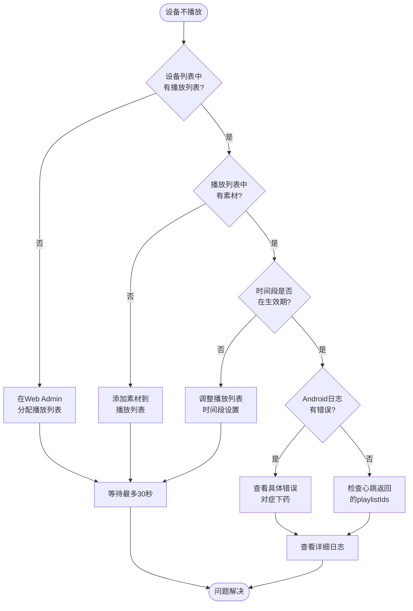
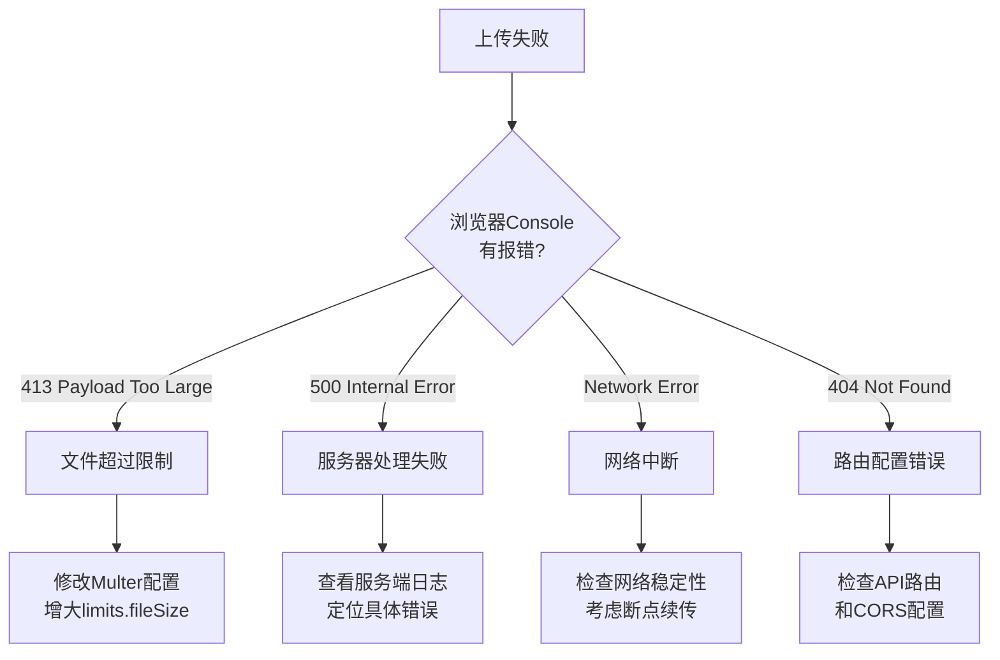
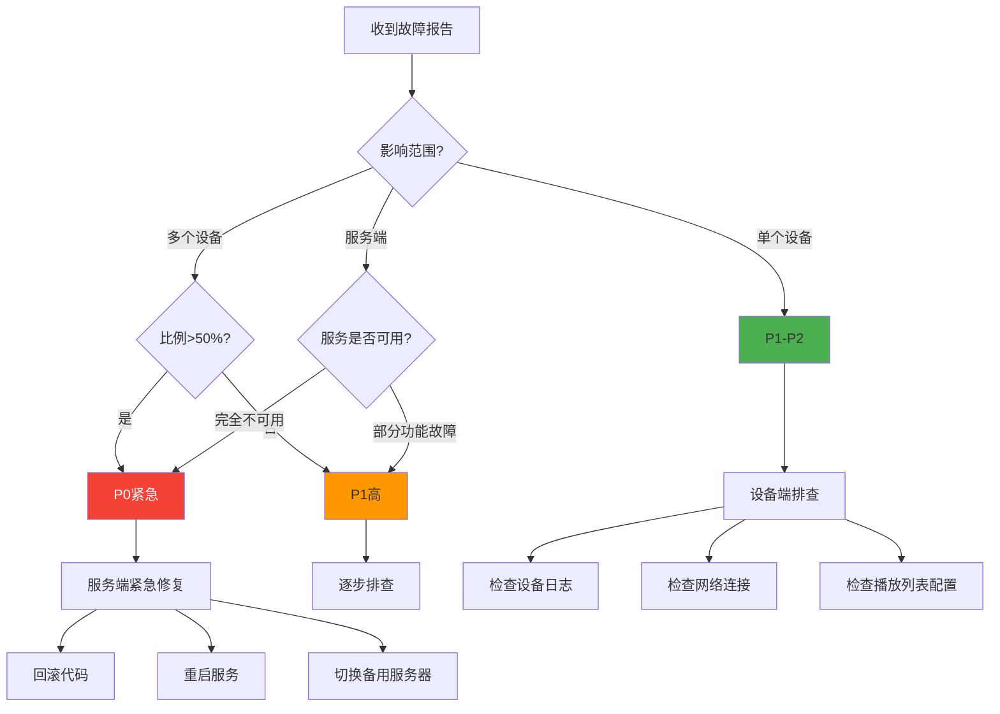

# Xplay 故障排查快速指南

> 快速定位和解决Xplay系统中的常见问题

---

## ⚠️ 重要说明

**本文档包含两种架构的故障排查方法：**

1. **Android Host Mode** (当前推荐) ✅
   - 主Pad运行内嵌Ktor服务器
   - 大部分故障排查可在主Pad监控面板完成

2. **NestJS服务器** (已废弃) ⚠️
   - 部分诊断脚本引用 `apps/_deprecated_server` 路径（或恢复后的 `apps/server`）
   - 详见 [废弃说明](./DEPRECATED_NESTJS_SERVER.md)

**如使用Android Host Mode，请重点关注第1-3节内容。**

---

## 🚨 一、紧急问题快速定位

### 1.1 设备完全无法连接服务器

**症状表现:**
- Android显示"与服务器不在同一局域网"
- 设备列表中看不到设备
- 心跳一直失败

**5分钟快速检查清单:**

```bash
# ✅ 步骤1: 检查服务器是否启动
curl http://localhost:3000/api/v1/ping
# 预期输出: "pong"

# ✅ 步骤2: 检查服务器监听地址
netstat -an | grep 3000
# 必须看到: 0.0.0.0:3000 (不能是127.0.0.1:3000)

# ✅ 步骤3: 检查防火墙
# Mac
sudo pfctl -s rules | grep 3000
# Linux
sudo iptables -L | grep 3000
# Windows
netsh advfirewall firewall show rule name=all | findstr 3000

# ✅ 步骤4: 从Android设备测试连接
# 在Android设备上用浏览器访问
http://<服务器IP>:3000/api/v1/ping
# 如果能访问，说明网络通的

# ✅ 步骤5: 检查服务器IP配置
# Android端配置的服务器IP必须是局域网IP，不能是127.0.0.1
# 服务器IP示例: 192.168.1.100
```

**修复方案:**

| 问题 | 解决方法 |
|-----|---------|
| 监听地址是127.0.0.1 | `main.ts`改为`app.listen(3000, '0.0.0.0')` |
| 防火墙拦截 | 开放3000端口: `sudo ufw allow 3000` |
| 跨网段 | 确保手机和服务器在同一Wi-Fi |
| Host Mode未启动 | 检查LocalServerService是否在运行 |

---

### 1.2 设备在线但不播放内容

**症状表现:**
- 设备状态显示"online"
- 心跳正常
- 但屏幕黑屏或显示"Empty Playlist"

**快速诊断流程:**



**Android日志查看:**

```bash
# 连接设备
adb devices

# 实时查看关键日志
adb logcat | grep -E "DeviceRepository|PlayerScreen|ExoPlayer"

# 查看最近的错误
adb logcat -d | grep -E "ERROR|FATAL|Exception" | tail -20

# 过滤心跳日志
adb logcat | grep "Heartbeat sent"
```

**关键检查点:**

```sql
-- 检查设备的播放列表分配 (服务端数据库)
SELECT d.name, p.name, p.startTime, p.endTime, p.daysOfWeek
FROM devices d
JOIN device_playlists dp ON d.id = dp.device_id
JOIN playlists p ON dp.playlist_id = p.id
WHERE d.serialNumber = '<设备序列号>';

-- 检查播放列表是否有素材
SELECT p.name, COUNT(pi.id) as item_count
FROM playlists p
LEFT JOIN playlist_items pi ON p.id = pi.playlistId
GROUP BY p.id;
```

---

### 1.3 视频播放黑屏/绿屏

**症状表现:**
- 图片能正常显示
- 视频只有声音没有画面
- 或者完全黑屏

**诊断方法:**

```bash
# 查看ExoPlayer错误日志
adb logcat | grep "ExoPlayer.*Error"

# 常见错误模式:
# 1. "Decoder init failed" - 解码器不支持
# 2. "No suitable decoder" - 缺少解码器
# 3. "MediaCodec error" - 硬件解码失败
```

**解决方案:**

| 错误类型 | 原因 | 解决方法 |
|---------|------|---------|
| 解码器不支持 | 视频编码格式罕见 | 转码为H.264+AAC (MP4) |
| 硬件解码失败 | 设备GPU不支持 | 已配置软解回退,应该自动处理 |
| 分辨率过高 | 4K视频在低端设备 | 降低分辨率到1080p |
| 文件损坏 | 上传不完整 | 重新上传素材 |

**推荐视频格式:**
```
编码: H.264 (baseline/main profile)
音频: AAC
容器: MP4
分辨率: 1920x1080 或更低
码率: 2-5 Mbps
```

**视频转码命令 (FFmpeg):**
```bash
ffmpeg -i input.mp4 \
  -c:v libx264 -profile:v baseline -level 3.0 \
  -c:a aac -b:a 128k \
  -s 1920x1080 \
  -b:v 3000k \
  output.mp4
```

---

### 1.4 素材上传失败

**症状表现:**
- 上传进度卡在某个百分比
- 上传完成但素材库看不到
- 浏览器显示413/500错误

**问题分析:**



**服务端配置检查:**

```typescript
// ⚠️ 仅适用于NestJS服务器（已废弃）
// 如重启NestJS: apps/_deprecated_server/src/media/media.module.ts
MulterModule.register({
  dest: './uploads',
  limits: {
    fileSize: 500 * 1024 * 1024, // 500MB限制
  },
})
```

**Nginx配置 (如果使用):**
```nginx
server {
    client_max_body_size 500M;  # 必须大于后端限制
    proxy_read_timeout 600s;     # 上传大文件需要更长超时
    proxy_send_timeout 600s;
}
```

**Host Mode上传问题:**

```kotlin
// LocalServerService.kt 的上传处理
// 检查日志中是否有 "Upload finished" 或 "Upload failed"
adb logcat | grep "LocalStore.*Upload"

// 如果看到内存不足错误
// 分批上传或降低文件大小
```

---

## 🔍 二、系统监控指标

### 2.1 关键日志位置

**服务端 (NestJS):**
```bash
# 开发模式
tail -f server.log

# 生产模式 (Docker)
docker logs -f xplay-server

# 关键日志搜索
grep "ERROR" server.log
grep "Registering device" server.log
grep "Heartbeat sent" server.log
```

**Android客户端:**
```bash
# 基础日志
adb logcat -s "DeviceRepository:D" "PlayerScreen:D" "LocalServerService:D"

# 网络请求日志
adb logcat | grep "OkHttp"

# 播放器日志
adb logcat | grep "ExoPlayer"

# 保存日志到文件
adb logcat -d > android_$(date +%Y%m%d_%H%M%S).log
```

**Host Mode (Ktor):**
```bash
# 查看内嵌服务器日志
adb logcat | grep "LocalServerService\|Ktor"

# 查看数据库操作
adb logcat | grep "Room\|SQLite"
```

### 2.2 性能监控SQL

```sql
-- 设备在线率统计
SELECT 
  COUNT(*) as total,
  SUM(CASE WHEN status = 'online' THEN 1 ELSE 0 END) as online,
  ROUND(100.0 * SUM(CASE WHEN status = 'online' THEN 1 ELSE 0 END) / COUNT(*), 2) as online_rate
FROM devices;

-- 素材使用率
SELECT 
  m.id,
  m.originalName,
  COUNT(pi.id) as used_in_playlists
FROM media m
LEFT JOIN playlist_items pi ON m.id = pi.mediaId
GROUP BY m.id
ORDER BY used_in_playlists DESC;

-- 最近心跳统计 (5分钟内)
SELECT 
  name,
  serialNumber,
  lastHeartbeat,
  ROUND((UNIX_TIMESTAMP(NOW()) - UNIX_TIMESTAMP(lastHeartbeat)) / 60, 1) as minutes_ago
FROM devices
WHERE lastHeartbeat >= DATE_SUB(NOW(), INTERVAL 5 MINUTE)
ORDER BY lastHeartbeat DESC;

-- 存储空间使用
SELECT 
  type,
  COUNT(*) as count,
  ROUND(SUM(size) / 1024 / 1024, 2) as total_mb
FROM media
GROUP BY type;
```

### 2.3 健康检查脚本

```bash
#!/bin/bash
# xplay_health_check.sh

echo "=== Xplay System Health Check ==="
echo ""

# 检查服务端
echo "1. Checking Server..."
SERVER_STATUS=$(curl -s http://localhost:3000/api/v1/ping)
if [ "$SERVER_STATUS" = "pong" ]; then
    echo "   ✅ Server is running"
else
    echo "   ❌ Server is DOWN"
fi

# 检查数据库连接
echo "2. Checking Database..."
# ⚠️ 注：如使用Android Host Mode，数据库在设备内部
# NestJS路径：apps/_deprecated_server/xplay.db (如已恢复则为 apps/server/xplay.db)
DB_CHECK=$(sqlite3 apps/_deprecated_server/xplay.db "SELECT COUNT(*) FROM devices;" 2>&1)
if [[ "$DB_CHECK" =~ ^[0-9]+$ ]]; then
    echo "   ✅ Database OK (${DB_CHECK} devices)"
else
    echo "   ❌ Database ERROR: $DB_CHECK"
fi

# 检查存储空间
echo "3. Checking Storage..."
# ⚠️ NestJS路径：apps/_deprecated_server/uploads/ (如已恢复则为 apps/server/uploads/)
UPLOAD_SIZE=$(du -sh apps/_deprecated_server/uploads/ | awk '{print $1}')
echo "   📦 Uploads folder: ${UPLOAD_SIZE}"

# 检查在线设备数
echo "4. Checking Online Devices..."
# ⚠️ NestJS路径（已废弃）
ONLINE=$(sqlite3 apps/_deprecated_server/xplay.db "SELECT COUNT(*) FROM devices WHERE status='online';" 2>/dev/null || echo "0")
TOTAL=$(sqlite3 apps/_deprecated_server/xplay.db "SELECT COUNT(*) FROM devices;" 2>/dev/null || echo "0")
echo "   📱 Online: ${ONLINE}/${TOTAL}"

# 检查最近错误
echo "5. Recent Errors..."
ERROR_COUNT=$(grep -c "ERROR" server.log 2>/dev/null || echo "0")
echo "   ⚠️  Errors in log: ${ERROR_COUNT}"

echo ""
echo "=== Health Check Complete ==="
```

---

## 🐛 三、常见Bug及解决方案

### 3.1 内存泄漏问题

**症状:**
- Android设备运行几天后卡顿
- 应用被系统杀掉
- OOM错误

**排查方法:**
```bash
# 查看应用内存占用
adb shell dumpsys meminfo com.xplay.player

# 查看是否有内存泄漏
adb logcat | grep "GC_FOR_ALLOC"

# 使用Android Profiler分析
# Android Studio -> Profiler -> Memory
```

**已知泄漏点及修复:**

| 位置 | 原因 | 修复方法 |
|-----|------|---------|
| ExoPlayer | 未正确释放 | `onDispose { exoPlayer.release() }` |
| WebView | 长期持有Activity | 播放时关闭WebView |
| Coil缓存 | 缓存无上限 | 配置LRU缓存大小 |
| NSD服务 | 未反注册 | `onDispose { nsdHelper.stopDiscovery() }` |

**优化配置:**
```kotlin
// Coil图片缓存配置
ImageLoader.Builder(context)
    .memoryCache {
        MemoryCache.Builder(context)
            .maxSizePercent(0.25) // 最多占用25%内存
            .build()
    }
    .diskCache {
        DiskCache.Builder()
            .maxSizeBytes(100 * 1024 * 1024) // 100MB磁盘缓存
            .build()
    }
    .build()
```

### 3.2 数据库锁死

**症状:**
- 服务端心跳请求卡住
- SQLite报错: "database is locked"
- 响应时间超过5秒

**原因分析:**
```
SQLite的单写入限制:
多个设备同时心跳 → 并发UPDATE → 写锁竞争 → 请求超时
```

**临时解决方案:**
```typescript
// ⚠️ 仅适用于NestJS服务器（已废弃）
// 如重启NestJS: apps/_deprecated_server/src/app.module.ts
// 切换到PostgreSQL
TypeOrmModule.forRoot({
  type: 'postgres',
  host: 'localhost',
  port: 5432,
  username: 'xplay',
  password: 'password',
  database: 'xplay',
  entities: [...],
  synchronize: true,
}),
```

**长期方案:**
1. 实现Redis缓存心跳数据
2. 异步写入数据库
3. 批量更新替代单个更新

### 3.3 播放列表循环错乱

**症状:**
- 播放顺序不符合预期
- 某些素材被跳过
- 素材重复播放

**调试方法:**
```kotlin
// 在PlayerScreen.kt添加日志
LaunchedEffect(currentIndex, playbackKey, playlist) {
    Log.d("PlayerScreen", "Current: $currentIndex/${playlist.items.size}")
    Log.d("PlayerScreen", "Current item: ${currentItem?.media?.url}")
}
```

**常见问题:**

1. **多播放列表合并顺序混乱:**
```kotlin
// DeviceRepository.kt 第160-192行
// 问题: 多个播放列表的items按获取顺序合并
// 解决: 按order字段排序
val sortedItems = allItems.sortedBy { it.order }
```

2. **索引越界:**
```kotlin
// PlayerScreen.kt 第38-42行
// 确保items非空
if (playlist.items.isNotEmpty()) {
    currentIndex = (currentIndex + 1) % playlist.items.size
} else {
    currentIndex = 0
}
```

### 3.4 NSD服务发现失败

**症状:**
- 客户端无法自动发现主机
- 一直显示"正在寻找主机..."
- 需要手动输入IP才能连接

**问题原因:**

1. **路由器不支持mDNS:**
   - 某些路由器禁用多播DNS
   - 企业网络可能阻止mDNS流量

2. **防火墙拦截:**
   - mDNS使用UDP 5353端口
   - 部分防火墙默认拦截

3. **服务端未注册:**
   - Host Mode未正确启动
   - NSD注册失败

**解决方案:**

```kotlin
// 1. 检查NSD注册日志
adb logcat | grep "NsdHelper"

// 2. 手动测试mDNS
// Mac/Linux
dns-sd -B _xplay._tcp local.

// 3. 降级方案: 使用固定域名
// Android端配置 server_host = "xplay.local"
// 服务器端配置 /etc/hosts
// 192.168.1.100  xplay.local
```

**最佳实践:**
- 保留手动输入IP的选项
- 提供扫描二维码配置功能
- 服务端提供配置引导页面

### 3.5 APK更新失败

**症状:**
- APK下载成功但不安装
- 循环下载APK
- 安装被系统拦截

**权限检查:**
```xml
<!-- AndroidManifest.xml -->
<uses-permission android:name="android.permission.REQUEST_INSTALL_PACKAGES" />
<uses-permission android:name="android.permission.WRITE_EXTERNAL_STORAGE" />
```

**Android 8.0+安装逻辑:**
```kotlin
// utils/ApkInstaller.kt
fun install(context: Context, apkFile: File) {
    if (Build.VERSION.SDK_INT >= Build.VERSION_CODES.O) {
        // 检查是否允许安装未知来源
        if (!context.packageManager.canRequestPackageInstalls()) {
            // 引导用户开启权限
            val intent = Intent(Settings.ACTION_MANAGE_UNKNOWN_APP_SOURCES)
            intent.data = Uri.parse("package:${context.packageName}")
            context.startActivity(intent)
            return
        }
    }
    
    // 使用FileProvider
    val uri = FileProvider.getUriForFile(
        context,
        "${context.packageName}.provider",
        apkFile
    )
    
    val intent = Intent(Intent.ACTION_VIEW)
    intent.setDataAndType(uri, "application/vnd.android.package-archive")
    intent.addFlags(Intent.FLAG_GRANT_READ_URI_PERMISSION)
    intent.addFlags(Intent.FLAG_ACTIVITY_NEW_TASK)
    context.startActivity(intent)
}
```

**FileProvider配置:**
```xml
<!-- res/xml/file_paths.xml -->
<paths>
    <cache-path name="apk_cache" path="." />
    <files-path name="apk_files" path="." />
</paths>

<!-- AndroidManifest.xml -->
<provider
    android:name="androidx.core.content.FileProvider"
    android:authorities="${applicationId}.provider"
    android:exported="false"
    android:grantUriPermissions="true">
    <meta-data
        android:name="android.support.FILE_PROVIDER_PATHS"
        android:resource="@xml/file_paths" />
</provider>
```

---

## 📊 四、问题优先级矩阵

### 4.1 问题分级

| 级别 | 影响 | 响应时间 | 示例 |
|------|------|---------|------|
| P0 - 紧急 | 所有设备离线/无法播放 | 立即 | 服务器宕机 |
| P1 - 高 | 部分设备异常 | 2小时内 | 特定设备播放黑屏 |
| P2 - 中 | 功能受限但可用 | 1天内 | 上传大文件失败 |
| P3 - 低 | 用户体验问题 | 1周内 | 界面排版错乱 |

### 4.2 故障影响范围评估



---

## 🔧 五、诊断工具箱

### 5.1 一键诊断脚本

```bash
#!/bin/bash
# xplay_diagnose.sh - 全面诊断工具

echo "=== Xplay System Diagnostics ==="
echo ""

# 1. 系统信息
echo "📋 System Info:"
echo "   OS: $(uname -s)"
echo "   Time: $(date)"
echo ""

# 2. 服务端状态
echo "🖥  Server Status:"
if pgrep -f "nest" > /dev/null; then
    echo "   ✅ NestJS is running"
    curl -s http://localhost:3000/api/v1/ping > /dev/null && echo "   ✅ API responding" || echo "   ❌ API not responding"
else
    echo "   ❌ NestJS is NOT running"
fi
echo ""

# 3. 数据库检查（⚠️ 仅适用于NestJS服务器）
echo "💾 Database Status:"
DB_PATH="apps/_deprecated_server/xplay.db"  # 或 apps/server/xplay.db 如已恢复
if [ -f "$DB_PATH" ]; then
    echo "   ✅ Database file exists"
    DEVICES=$(sqlite3 "$DB_PATH" "SELECT COUNT(*) FROM devices;" 2>/dev/null || echo "0")
    ONLINE=$(sqlite3 "$DB_PATH" "SELECT COUNT(*) FROM devices WHERE status='online';" 2>/dev/null || echo "0")
    MEDIA=$(sqlite3 "$DB_PATH" "SELECT COUNT(*) FROM media;" 2>/dev/null || echo "0")
    PLAYLISTS=$(sqlite3 "$DB_PATH" "SELECT COUNT(*) FROM playlists;" 2>/dev/null || echo "0")
    echo "   Devices: $ONLINE/$DEVICES online"
    echo "   Media: $MEDIA files"
    echo "   Playlists: $PLAYLISTS"
else
    echo "   ❌ Database file not found"
fi
echo ""

# 4. 网络端口
echo "🌐 Network Ports:"
netstat -an | grep "3000.*LISTEN" > /dev/null && echo "   ✅ Port 3000 listening" || echo "   ❌ Port 3000 not listening"
netstat -an | grep "3001.*LISTEN" > /dev/null && echo "   ✅ Port 3001 listening (Web Admin)" || echo "   ⚠️  Port 3001 not listening"
echo ""

# 5. 存储空间（⚠️ 仅适用于NestJS服务器）
echo "📦 Storage:"
UPLOAD_DIR="apps/_deprecated_server/uploads/"  # 或 apps/server/uploads/ 如已恢复
UPLOAD_SIZE=$(du -sh "$UPLOAD_DIR" 2>/dev/null | awk '{print $1}' || echo "N/A")
echo "   Uploads: $UPLOAD_SIZE"
DISK_USAGE=$(df -h . | tail -1 | awk '{print $5}')
echo "   Disk usage: $DISK_USAGE"
echo ""

# 6. 日志分析
echo "📝 Recent Errors:"
if [ -f "server.log" ]; then
    ERROR_COUNT=$(grep -c "ERROR" server.log)
    echo "   Total errors: $ERROR_COUNT"
    if [ $ERROR_COUNT -gt 0 ]; then
        echo "   Last 5 errors:"
        grep "ERROR" server.log | tail -5 | sed 's/^/      /'
    fi
else
    echo "   ⚠️  No log file found"
fi
echo ""

# 7. Android设备检查
echo "📱 Android Devices:"
ADB_DEVICES=$(adb devices | grep -v "List" | grep "device$" | wc -l)
if [ $ADB_DEVICES -gt 0 ]; then
    echo "   ✅ $ADB_DEVICES device(s) connected via ADB"
    adb devices | grep "device$" | awk '{print "      - " $1}'
else
    echo "   ⚠️  No Android devices connected"
fi
echo ""

# 8. 建议
echo "💡 Recommendations:"
if [ $ERROR_COUNT -gt 100 ]; then
    echo "   ⚠️  High error count - check server logs"
fi
if [ $ONLINE -eq 0 ] && [ $DEVICES -gt 0 ]; then
    echo "   ⚠️  All devices offline - check network connectivity"
fi
if [ "$UPLOAD_SIZE" = "N/A" ]; then
    echo "   ⚠️  Uploads folder not found"
fi

echo ""
echo "=== Diagnostics Complete ==="
```

### 5.2 Android调试工具

```bash
#!/bin/bash
# android_debug.sh

# 选择设备
DEVICE=$(adb devices | grep "device$" | head -1 | awk '{print $1}')
if [ -z "$DEVICE" ]; then
    echo "❌ No Android device found"
    exit 1
fi

echo "📱 Debugging device: $DEVICE"
echo ""

# 1. 应用信息
echo "📦 App Info:"
adb -s $DEVICE shell dumpsys package com.xplay.player | grep "versionName"
echo ""

# 2. 内存占用
echo "💾 Memory Usage:"
adb -s $DEVICE shell dumpsys meminfo com.xplay.player | grep -A 10 "App Summary"
echo ""

# 3. 网络连接
echo "🌐 Network:"
IP=$(adb -s $DEVICE shell ip addr show wlan0 | grep "inet " | awk '{print $2}')
echo "   Device IP: $IP"
echo ""

# 4. SharedPreferences配置
echo "⚙️  App Config:"
adb -s $DEVICE shell "run-as com.xplay.player cat /data/data/com.xplay.player/shared_prefs/xplay_prefs.xml"
echo ""

# 5. 数据库检查
echo "💾 Local Database:"
adb -s $DEVICE shell "run-as com.xplay.player ls -lh /data/data/com.xplay.player/databases/"
echo ""

# 6. 实时日志
echo "📝 Live Logs (Ctrl+C to stop):"
adb -s $DEVICE logcat | grep -E "DeviceRepository|PlayerScreen|ExoPlayer|LocalServerService"
```

---

## 📚 六、参考资料

### 6.1 官方文档

- [NestJS官方文档](https://docs.nestjs.com/)
- [Android ExoPlayer文档](https://exoplayer.dev/)
- [Ktor文档](https://ktor.io/docs/)
- [TypeORM文档](https://typeorm.io/)

### 6.2 相关Issue

| Issue | 描述 | 解决方案 |
|-------|------|---------|
| #001 | 设备重复注册 | 修复serialNumber获取逻辑 |
| #002 | 视频播放黑屏 | 配置软解回退 |
| #003 | SQLite锁死 | 切换PostgreSQL |
| #004 | Host Mode白屏 | 初始化web-admin资源 |

### 6.3 社区支持

- GitHub Issues: [待补充]
- 技术论坛: [待补充]
- 企业支持: [待补充]

---

## 🎯 七、最佳实践

### 7.1 开发环境

```bash
# 推荐开发配置
- macOS 13+ / Ubuntu 22.04+ / Windows 11 WSL2
- Node.js 18+
- pnpm 8+
- Android Studio Hedgehog+
- VSCode + 插件:
  - ESLint
  - Prettier
  - TypeScript
  - Kotlin
```

### 7.2 部署环境

```yaml
# 生产环境推荐配置
Server:
  CPU: 4核+
  RAM: 8GB+
  Storage: 200GB+ SSD
  OS: Ubuntu 22.04 LTS
  
Database:
  PostgreSQL 14+
  Master-Slave replication
  
Network:
  Bandwidth: 100Mbps+
  稳定内网环境
```

### 7.3 监控告警

```yaml
# 建议监控指标
- 设备在线率 < 90% → 告警
- API响应时间 > 3秒 → 告警  
- 错误日志 > 100条/小时 → 告警
- 磁盘使用率 > 80% → 告警
- 数据库连接数 > 80% → 告警
```

---

**文档版本**: v1.0  
**创建时间**: 2026-01-16  
**维护者**: AI Assistant

**紧急联系方式**: [待补充]
